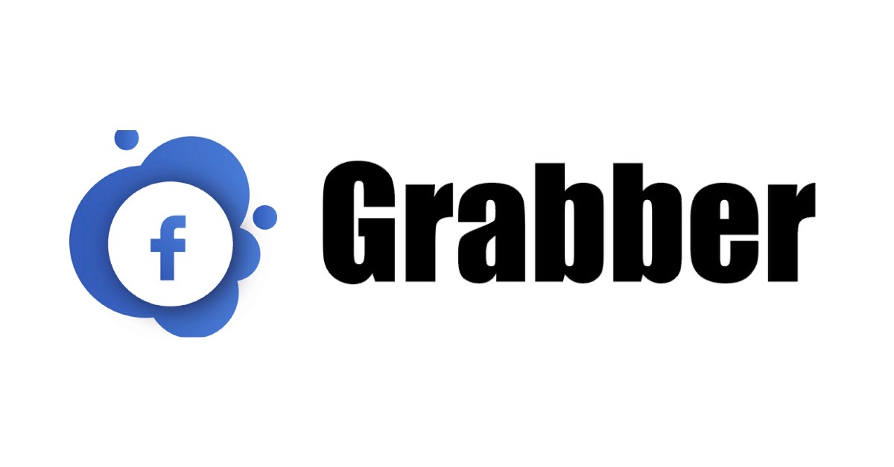

<!-- F-Grabber -->

<p align="center">
  
</p>

<p align="center">
  
</p>

<p align="center">
  
  
  
  
</p>

<p align="center">A beginner friendly, Automated phishing Tolz For Facebook.</p>

##

### Features

- Latest and updated login pages.
- Mask URL support 
- Beginners friendly
- Docker support (checkout `docker-legacy` branch)
- Multiple tunneling options
  - Localhost
  - Ngrok (With or without hotspot)


### Installation

- Just, Clone this repository -
```
$ git clone git://github.com/maxwellcasper/F-Grabber.git
```

- Change to cloned directory and run `fgrabber.sh` -
```
$ cd F-Grabber
$ bash fgrabber.sh
```

- On first launch, It'll install the dependencies and that's it. `fgrabber` is installed.

### Run on Docker
```
$ docker pull maxwellcasper/F-Grabber
$ docker run --rm -it maxwellcasper/fgrabber
```

### Dependencies

**`F-Grabber `** requires following programs to run properly - 
- `php`
- `wget`
- `curl`
- `git`

> All the dependencies will be installed automatically when you run `F-Grabber` for the first time.

> Supported Platform : **`Termux`**, **`Ubuntu/Debian/Kali`**, **`Arch Linux/Manjaro`**, **`Fedora`**

##

<h3 align="center">
:: Workflow ::
</h3>
<p align="center">

</p>

### Find Me on :
<p align="left">
  <a href="https://m.me/casper0147" target="_blank"></a>
</p>
